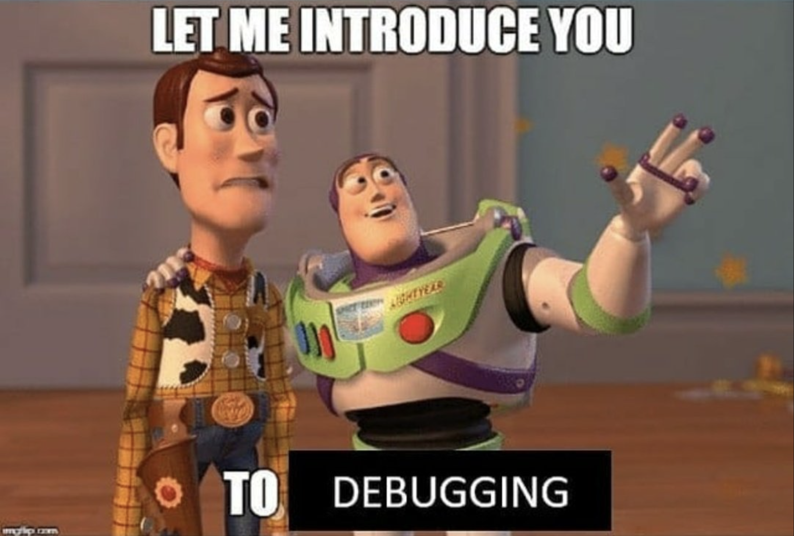

# Debugging in Software Development

  

> You can't keep doing the same thing and expect different results

Debugging is a crucial part of the software development process. It is the process of identifying and fixing errors, or bugs, in software applications. The term "debugging" comes from the story of Grace Hopper, a computer scientist who removed a moth from a computer in 1947, coining the term "debugging". She is credited with popularizing the term when she actually found a moth in the computer.

Debugging can be a complex and challenging process that requires a methodical approach. It is a skill that is essential to software development, and it is important to learn how to debug effectively.

## Rubber Duck Debugging

One popular technique for debugging is known as "rubber duck debugging." This involves explaining the problem to a rubber duck (or any inanimate object) in order to better understand it. The process of explaining the problem can help identify any gaps in understanding and clarify the issue at hand.

## Best Practices for Debugging

- Understand the problem: Take the time to fully understand the problem you are trying to solve. Gather as much information as possible about the issue and the conditions under which it occurs.
- Reproduce the issue: Try to reproduce the problem in a controlled environment. This can help isolate the issue and make it easier to debug.
- Use debuggers: Debuggers are powerful tools that can help you identify and fix errors in your code. Learn how to use a debugger effectively.
- Test as you go: Test your code as you write it. This can help catch errors early in the development process and make debugging easier.
- Keep a record: Keep a record of the errors you encounter and how you fixed them. This can be helpful in case you encounter a similar problem in the future.

## Debugging with GDB

GDB is a powerful debugging tool that allows you to step through your code and examine its state. Here are the steps to install and use GDB:

- Install GDB: You can install GDB on Linux using the command `sudo apt-get install gdb`.
- Compile your code with debugging symbols: You can do this using the `-g` flag when compiling your code.
- Start GDB: Run the command `gdb <executable>` to start GDB.
- Set breakpoints: You can set breakpoints in your code using the `break` command.
- Step through your code: You can step through your code using the `next` command.
- Examine variables: You can examine the value of variables using the `print` command.

## Quote

> "Debugging is like being a detective in a mystery movie where you are also the murderer." - Filipe Fortes

Debugging can be a challenging and frustrating process, but with the right approach and tools, it can be a rewarding experience. Happy debugging!
