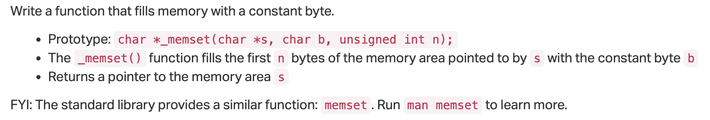
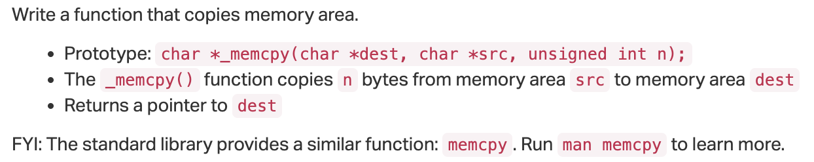
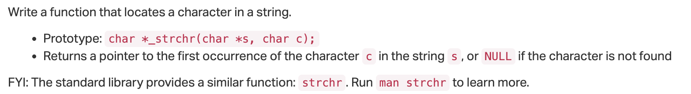
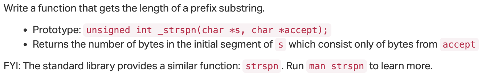
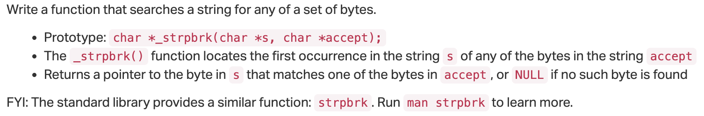
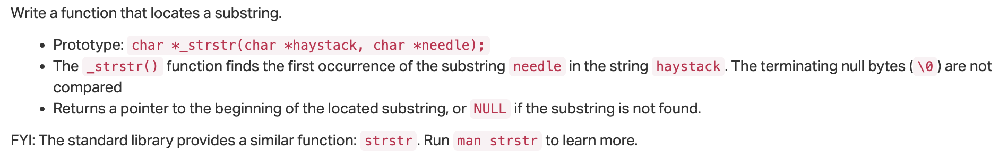
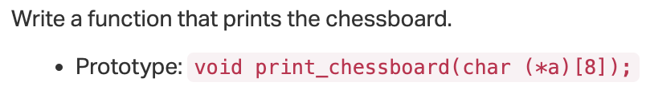
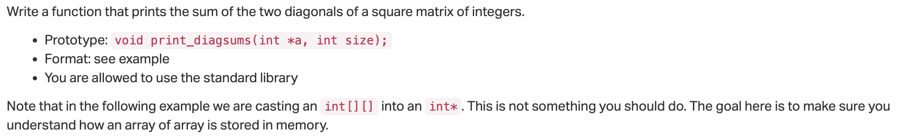
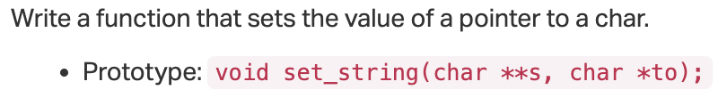
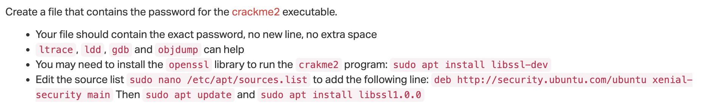

# 0x07. C - Even more pointers, arrays and strings

## Resources
- [C - Pointer to Pointer](https://www.tutorialspoint.com/cprogramming/c_pointer_to_pointer.htm)
- [C - Pointer to Pointer with example](https://www.programiz.com/c-programming/c-pointer-pointer)
- [Multi-dimensional Arrays in C](https://www.geeksforgeeks.org/multi-dimensional-arrays-c-cpp/)
- [Two dimensional (2D) arrays in C programming with example](https://www.programiz.com/c-programming/c-multi-dimensional-arrays)

## Learning Objectives
- [What are pointers to pointers and how to use them](#what-is-a-pointer-to-a-pointer-and-how-to-use-it)
- [What are multidimensional arrays and how to use them](#what-is-a-multidimensional-array-and-how-to-use-it)
- [What are the most common C standard library functions to manipulate strings](#what-are-the-most-common-c-standard-library-functions-to-manipulate-strings)

### What is a pointer to a pointer and how to use it?

### What is a multidimensional array and how to use it?

### What are the most common C standard library functions to manipulate strings?

## Tasks
- All `*-main.c` files are provided in the `[test_files](./test_files)` directory.
- We will be using function prototypes from the `[main.h](./main.h)` header file for this project.

---

<details>
<summary><a href="0-memset.c">0. memset</a></summary>



```c
#include "main.h"
#include <stdio.h>

/**
 * simple_print_buffer - prints buffer in hexa
 * @buffer: the address of memory to print
 * @size: the size of the memory to print
 *
 * Return: Nothing.
 */
void simple_print_buffer(char *buffer, unsigned int size)
{
        unsigned int i;

        i = 0;
        while (i < size)
        {
                if (i % 10)
                {
                        printf(" ");
                }
                if (!(i % 10) && i)
                {
                        printf("\n");
                }
                printf("0x%02x", buffer[i]);
                i++;
        }
        printf("\n");
}

/**
 * main - check the code
 *
 * Return: Always 0.
 */
int main(void)
{
    char buffer[98] = {0x00};

    simple_print_buffer(buffer, 98);
    _memset(buffer, 0x01, 95);
    printf("-------------------------------------------------\n");
    simple_print_buffer(buffer, 98);    
    return (0);
}
```
> Expected output:
```shell
0x00 0x00 0x00 0x00 0x00 0x00 0x00 0x00 0x00 0x00
0x00 0x00 0x00 0x00 0x00 0x00 0x00 0x00 0x00 0x00
0x00 0x00 0x00 0x00 0x00 0x00 0x00 0x00 0x00 0x00
0x00 0x00 0x00 0x00 0x00 0x00 0x00 0x00 0x00 0x00
0x00 0x00 0x00 0x00 0x00 0x00 0x00 0x00 0x00 0x00
0x00 0x00 0x00 0x00 0x00 0x00 0x00 0x00 0x00 0x00
0x00 0x00 0x00 0x00 0x00 0x00 0x00 0x00 0x00 0x00
0x00 0x00 0x00 0x00 0x00 0x00 0x00 0x00 0x00 0x00
0x00 0x00 0x00 0x00 0x00 0x00 0x00 0x00 0x00 0x00
0x00 0x00 0x00 0x00 0x00 0x00 0x00 0x00
-------------------------------------------------
0x01 0x01 0x01 0x01 0x01 0x01 0x01 0x01 0x01 0x01
0x01 0x01 0x01 0x01 0x01 0x01 0x01 0x01 0x01 0x01
0x01 0x01 0x01 0x01 0x01 0x01 0x01 0x01 0x01 0x01
0x01 0x01 0x01 0x01 0x01 0x01 0x01 0x01 0x01 0x01
0x01 0x01 0x01 0x01 0x01 0x01 0x01 0x01 0x01 0x01
0x01 0x01 0x01 0x01 0x01 0x01 0x01 0x01 0x01 0x01
0x01 0x01 0x01 0x01 0x01 0x01 0x01 0x01 0x01 0x01
0x01 0x01 0x01 0x01 0x01 0x01 0x01 0x01 0x01 0x01
0x01 0x01 0x01 0x01 0x01 0x01 0x01 0x01 0x01 0x01
0x01 0x01 0x01 0x01 0x01 0x00 0x00 0x00
```

> Compile with:
```shell
gcc -Wall -pedantic -Werror -Wextra -std=gnu89 0-main.c 0-memset.c -o 0-memset
```
</details>

---

<details>
<summary><a href="1-memcpy.c">1. memcpy</a></summary>




</details>

---

<details>
<summary><a href="2-strchr.c">2. strchr</a></summary>



</details>

---

<details>
<summary><a href="3-strspn.c">3. strspn</a></summary>



</details>

---

<details>
<summary><a href="4-strpbrk.c">4. strpbrk</a></summary>



</details>

---

<details>
<summary><a href="5-strstr.c">5. strstr</a></summary>



</details>

---

<details>
<summary><a href="7-print_chessboard.c">6. Chess is mental torture</a></summary>



</details>

---

<details>
<summary><a href="8-print_diagsums.c">7. The line of life is a ragged diagonal between duty and desire</a></summary>



</details>

---

<details>
<summary><a href="100-set_string.c">8. Double pointer, double fun</a></summary>



</details>

---

<details>
<summary><a href="101-crackme_password">9. My primary goal of hacking was the intellectual curiosity, the seduction of adventure</a></summary>



</details>

