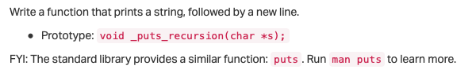
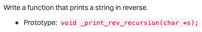
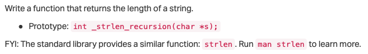
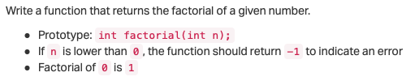
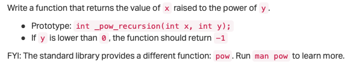
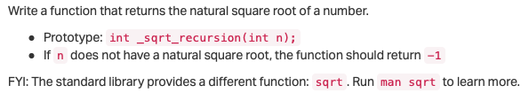
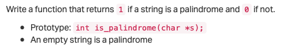
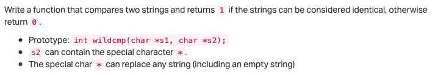

# 0x08. C - Recursion

## Resources
## Learning Objectives


## Tasks
- All `*-main.c` files are provided in the `[test_files](./test_files)` directory.
- We will be using function prototypes from the `[main.h](./main.h)` header file for this project.

---

<details>
<summary><a href="0-puts_recursion.c">0. She locked away a secret, deep inside herself, something she once knew to be true... but chose to forget</a></summary>



## Task 0


```c
#include "main.h"

/**
 * main - check the code
 *
 * Return: Always 0.
 */
int main(void)
{
    _puts_recursion("Puts with recursion");
    return (0);
}
```

> compiled with: `gcc -Wall -pedantic -Werror -Wextra -std=gnu89 _putchar.c 0-main.c 0-puts_recursion.c -o 0-puts_recursion`

> Output:
>```shell
> Puts with recursion 
>```

</details>

---

<details>
<summary><a href="1-print_rev_recursion.c">1. Why is it so important to dream? Because, in my dreams we are together</a></summary>

## Task 1



```c
#include "main.h"

/**
 * main - check the code
 *
 * Return: Always 0.
 */
int main(void)
{
    _print_rev_recursion("\nColton Walker");
    return (0);
}
```

> Compiled with: `gcc -Wall -pedantic -Werror -Wextra -std=gnu89 _putchar.c 1-main.c 1-print_rev_recursion.c -o 1-print_rev_recursion`

> Output:
> ```shell
> reklaW notloC
>```

</details>

---

<details>
<summary><a href="2-strlen_recursion.c">2. Dreams feel real while we're in them. It's only when we wake up that we realize something was actually strange</a></summary>

## Task 2



```c
#include "main.h"
#include <stdio.h>

/**
 * main - check the code
 *
 * Return: Always 0.
 */
int main(void)
{
    int n;

    n = _strlen_recursion("Corbin Coleman");
    printf("%d\n", n);
    return (0);
}
```

> Compiled with: `gcc -Wall -pedantic -Werror -Wextra -std=gnu89 2-main.c 2-strlen_recursion.c -o 2-strlen_recursion`

> Output:
> ```shell
> 14
>```

</details>

---

<details>
<summary><a href="3-factorial.c">3. You mustn't be afraid to dream a little bigger, darling</a></summary>

## Task 3



```c
julien@ubuntu:~/0x08. Recursion$ cat 3-main.c
#include "main.h"
#include <stdio.h>

/**
 * main - check the code
 *
 * Return: Always 0.
 */
int main(void)
{
    int r;

    r = factorial(1);
    printf("%d\n", r);
    r = factorial(5);
    printf("%d\n", r);
    r = factorial(10);
    printf("%d\n", r);
    r = factorial(-1024);
    printf("%d\n", r);
    return (0);
}
```

> Compiled with: `gcc -Wall -pedantic -Werror -Wextra -std=gnu89 3-main.c 3-factorial.c -o 3-factorial`

> Output:
> ```c
> 1
> 120
> 3628800
> -1
> ```

</details>

---

<details>

## Task 4



```c
#include "main.h"
#include <stdio.h>

/**
 * main - check the code
 *
 * Return: Always 0.
 */
int main(void)
{
    int r;

    r = _pow_recursion(1, 10);
    printf("%d\n", r);
    r = _pow_recursion(1024, 0);
    printf("%d\n", r);
    r = _pow_recursion(2, 16);
    printf("%d\n", r);
    r = _pow_recursion(5, 2);
    printf("%d\n", r);
    r = _pow_recursion(5, -2);
    printf("%d\n", r);
    r = _pow_recursion(-5, 3);
    printf("%d\n", r);
    return (0);
}
```

> compiled with: `gcc -Wall -pedantic -Werror -Wextra -std=gnu89 4-main.c 4-pow_recursion.c -o 4-pow_recursion`

> Output:
> ```shell
> 1
> 1
> 65536
> 25
> -1
> -125
> ```

</details>

---

<details>
<summary><a href="5-sqrt_recursion.c">5. Your subconscious is looking for the dreamer</a></summary>

## Task 5



```c
#include "main.h"
#include <stdio.h>

/**
 * main - check the code
 *
 * Return: Always 0.
 */
int main(void)
{
    int r;

    r = _sqrt_recursion(1);
    printf("%d\n", r);
    r = _sqrt_recursion(1024);
    printf("%d\n", r);
    r = _sqrt_recursion(16);
    printf("%d\n", r);
    r = _sqrt_recursion(17);
    printf("%d\n", r);
    r = _sqrt_recursion(25);
    printf("%d\n", r);
    r = _sqrt_recursion(-1);
    printf("%d\n", r);
    return (0);
}
```

> Compiled with: `gcc -Wall -pedantic -Werror -Wextra -std=gnu89 5-main.c 5-sqrt_recursion.c -o 5-sqrt_recursion`

> Output:
> ```shell
> 1
> 32
> 4
> -1
> 5
> -1
> ```

</details> 

---

<details>
<summary><a href="6-is_prime_number.c">6. Inception. Is it possible?</a></summary>

## Task 6


```c
#include "main.h"
#include <stdio.h>

/**
 * main - check the code
 *
 * Return: Always 0.
 */
int main(void)
{
    int r;

    r = is_prime_number(1);
    printf("%d\n", r);
    r = is_prime_number(1024);
    printf("%d\n", r);
    r = is_prime_number(16);
    printf("%d\n", r);
    r = is_prime_number(17);
    printf("%d\n", r);
    r = is_prime_number(25);
    printf("%d\n", r);
    r = is_prime_number(-1);
    printf("%d\n", r);
    r = is_prime_number(113);
    printf("%d\n", r);
    r = is_prime_number(7919);
    printf("%d\n", r);
    return (0);
}
```

> Compiled with: `gcc -Wall -pedantic -Werror -Wextra -std=gnu89 6-main.c 6-is_prime_number.c -o 6-is_prime_number`

> Output:
> ```shell
> 0
> 0
> 0
> 1
> 0
> 0
> 1
> 1
> ```

</details>

---

<details>
<summary><a href="100-is_palindrome.c">7. They say we only use a fraction of our brain's true potential. Now that's when we're awake. When we sleep, we can do almost anything</a></summary>

## Task 7



```c
#include "main.h"
#include <stdio.h>

/**
 * main - check the code
 *
 * Return: Always 0.
 */
int main(void)
{
    int r;

    r = is_palindrome("level");
    printf("%d\n", r);
    r = is_palindrome("redder");
    printf("%d\n", r);
    r = is_palindrome("test");
    printf("%d\n", r);
    r = is_palindrome("step on no pets");
    printf("%d\n", r);
    return (0);
}
```

> Compiled with: `gcc -Wall -pedantic -Werror -Wextra -std=gnu89 7-main.c 7-is_palindrome.c -o 7-is_palindrome`

> Output:
> ```shell
> 1
> 1
> 0
> 1
> ```

</details>

---

<details>
<summary><a href="101-wildcmp.c">8. Inception. Now, before you bother telling me it's impossible...</a></summary>

## Task 8



```c
#include "main.h"
#include <stdio.h>

/**
 * main - check the code
 *
 * Return: Always 0.
 */
int main(void)
{
    int r;

    r = wildcmp("main.c", "*.c");
    printf("%d\n", r);
    r = wildcmp("main.c", "m*a*i*n*.*c*");
    printf("%d\n", r);
    r = wildcmp("main.c", "main.c");
    printf("%d\n", r);
    r = wildcmp("main.c", "m*c");
    printf("%d\n", r);
    r = wildcmp("main.c", "ma********************************c");
    printf("%d\n", r);
    r = wildcmp("main.c", "*");
    printf("%d\n", r);
    r = wildcmp("main.c", "***");
    printf("%d\n", r);
    r = wildcmp("main.c", "m.*c");
    printf("%d\n", r);
    r = wildcmp("main.c", "**.*c");
    printf("%d\n", r);
    r = wildcmp("main-main.c", "ma*in.c");
    printf("%d\n", r);
    r = wildcmp("main", "main*d");
    printf("%d\n", r);
    r = wildcmp("abc", "*b");
    printf("%d\n", r);
    return (0);
}
```

> Compiled with: `gcc -Wall -pedantic -Werror -Wextra -std=gnu89 100-main.c 100-wildcmp.c -o 100-wildcmp`

> Output:
> ```shell
> 1
> 1
> 1
> 1
> 1
> 1
> 1
> 0
> 1
> 1
> 0
> 0
> ```

</details>

