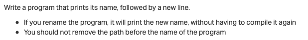

<!--
<b align="center">

</b>
-->

<h1 align="center">0x0A. C - argc, argv</h1>

## Resources
- [Arguments to main](https://publications.gbdirect.co.uk//c_book/chapter10/arguments_to_main.html)
- [argc and argv](https://publications.gbdirect.co.uk//c_book/chapter10/argc_and_argv.html)
- [What does argc and argv mean?](https://www.youtube.com/watch?v=4Qy7JhDkhxI)
- [how to compile with unused variables](https://stackoverflow.com/questions/142508/how-do-i-check-code-for-unreferenced-variables-and-functions-using-gcc)

## Learning Objectives
- [How to use arguments passed to your program](#how-to-use-arguments-passed-to-your-program)
- [What are two prototypes of `main` that you know of, and in which case do you use one or the other](#what-are-two-prototypes-of-main-that-you-know-of-and-in-which-case-do-you-use-one-or-the-other)
- [How to use `__attribute__((unused))` or `(void)` to compile functions with unused variables or parameters](#how-to-use-__attributeunused-or-void-to-compile-functions-with-unused-variables-or-parameters)

> ### Learning Objectives - Explanation

#### How to use arguments passed to your program

When a program is executed, it can receive command-line arguments from the user. These arguments are passed to the program as a list of strings, and the program can use them to modify its behavior. Here's how to use command-line arguments in a C program:

- The main function of the program should accept two arguments: an integer argument count (argc) and an array of strings (argv) that contain the arguments passed to the program.
- The first element of the argv array (argv[0]) contains the name of the program itself. The remaining elements (argv[1], argv[2], etc.) contain the command-line arguments passed to the program.
- To access the command-line arguments, you can use array indexing to access the argv array. For example, argv[1] would give you the first command-line argument passed to the program.
- You can use a loop to iterate over all the command-line arguments passed to the program. For example, the following code snippet prints out all the command-line arguments passed to the program:
```c
#include <stdio.h>

int main(int argc, char *argv[]) {
    int i;
    for (i = 1; i < argc; i++) {
        printf("Argument %d: %s\n", i, argv[i]);
    }
    return 0;
}
```

#### What are two prototypes of `main` that you know of, and in which case do you use one or the other

There are two prototypes of the main function in C:

- `int main(void)`: This is the standard prototype of the `main` function. It takes no arguments and returns an integer value. This form of the `main` function is used when the program does not need to receive any arguments from the command line.
- `int main(int argc, char *argv[])`: This is an alternate prototype of the `main` function. It takes two arguments: an integer value `argc` and an array of pointers to strings `argv[]`. The `argc` argument contains the number of arguments passed to the program on the command line, while the `argv[]` argument contains an array of strings that represent those arguments. This form of the `main` function is used when the program needs to receive arguments from the command line.


#### How to use `__attribute__((unused))` or `(void)` to compile functions with unused variables or parameters

In C, it's common to have variables or parameters in functions that are not used in the body of the function. This can generate compiler warnings that can be annoying to deal with. To avoid these warnings, you can use either the `__attribute__((unused))` or `(void)` method to indicate that a variable or parameter is intentionally unused.

Here's how to use each method:

1. using `__attribute__((unused))`:
You can use the `__attribute__((unused))` syntax to tell the compiler that a variable or parameter is intentionally unused. Here's an example:
```c
void my_function(int x, __attribute__((unused)) int y) {
    // Do something with x
}
```
The `y` parameter is not used in the body of the function, but the `__attribute__((unused))` syntax tells the compiler that this is intentional and that it should not generate a warning.

2. using `(void)`:
You can also use the `(void)` syntax to tell the compiler that a variable or parameter is intentionally unused. Here's an example:
```c
void my_function(int x, int y) {
    // Do something with x
    (void)y;
}
```
The `(void)y` syntax tells the compiler that the `y` parameter is not used in the body of the function, but that this is intentional and that it should not generate a warning.

## Tasks

- [0. It ain't what they call you, it's what you answer to](./0-whatsmyname.c)
- [1. Silence is argument carried out by other means](./1-args.c)
- [2. The best argument against democracy is a five-minute conversation with the average voter](./2-args.c)
- [3. Neither irony nor sarcasm is argument](./3-mul.c)
- [4. To infinity and beyond](./4-add.c)
- [5. Minimal Number of Coins for Change](./100-change.c)

---

<details>
<summary><a href="./0-whatsmyname.c">0. It ain't what they call you, it's what you answer to</a></summary>

### Task 0



> Compiled with: `gcc -Wall -pedantic -Werror -Wextra 0-whatsmyname.c -o 0-whatsmyname`

> Output:
> ```
> $ ./0-whatsmyname
> ./0-whatsmyname
> $ mv 0-whatsmyname mynameis
> $ ./mynameis
> ./mynameis
> ```

</details>