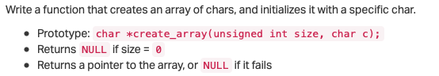
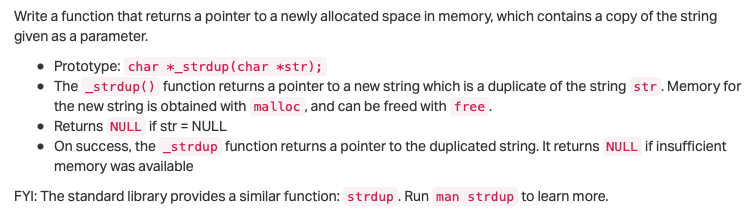
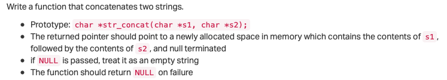

# 0x0B. C - malloc, free

## Resources
- [0x0a - malloc & free - quick overview.pdf]()
- [Dynamic memory allocation in C - malloc calloc realloc free (stop at 6:50)](https://www.youtube.com/watch?v=xDVC3wKjS64)


## Learning Objectives
- [What is the difference between automatic and dynamic allocation](#what-is-the-difference-between-automatic-and-dynamic-allocation)
- [What is `malloc` and `free` and how to use them](#what-is-malloc-and-free-and-how-to-use-them)
- [Why and when use `malloc`](#why-and-when-use-malloc)
- [How to use `valgrind` to check for memory leak](#how-to-use-valgrind-to-check-for-memory-leak)

#### What is the difference between automatic and dynamic allocation
**Automatic** and **dynamic allocation** are two ways to allocate memory for variables in a program.

**Automatic allocation** happens when you declare a variable with a fixed size within a function or a block. The memory for the variable is allocated on the stack and is automatically freed when the function or block exits. For example:

```c
void my_function()
{
    int my_array[10]; // automatic allocation
}
```

In this example, `my_array` is an array of 10 integers that is automatically allocated on the stack when `my_function()` is called. When `my_function()` exits, the memory for `my_array` is automatically freed.

**Dynamic allocation**, on the other hand, allows you to allocate memory on the heap at runtime using functions like `malloc()`, `calloc()`, and `realloc()`. The size of the memory block can be determined at runtime and can change during the execution of the program. The memory allocated dynamically must be explicitly freed using the `free()` function when it’s no longer needed. For example:
```c
void my_function()
{
    int *my_array = malloc(10 * sizeof(int)); // dynamic allocation
    // use my_array
    free(my_array);
}
```

In this example, `my_array` is a pointer to an array of 10 integers that is dynamically allocated on the heap using `malloc()`. When we’re done using `my_array`, we need to explicitly free its memory using `free()`.

The main difference between automatic and dynamic allocation is that automatic allocation happens on the stack and is managed by the compiler while dynamic allocation happens on the heap and must be managed by

#### What is `malloc` and `free` and how to use them

`malloc` and `free` are two functions from the `<stdlib.h>` library that are used to dynamically allocate and deallocate memory on the heap.

`malloc` stands for **memory allocation**. It takes one argument: the number of bytes to allocate on the heap. It returns a pointer to the allocated memory block or `NULL` if the allocation fails. Here’s an example:
```c
#include <stdlib.h>

int *my_array = malloc(10 * sizeof(int)); // allocate memory for 10 integers
```
In this example, we use `malloc` to allocate enough memory on the heap to hold an array of 10 integers. The size of each integer is determined using the `sizeof` operator.

Once you’re done using a dynamically allocated memory block, you need to explicitly free it using the `free` function. This returns the memory back to the system, so it can be reused by other parts of your program or other programs running on your computer. Here’s an example:
```c
#include <stdlib.h>

int *my_array = malloc(10 * sizeof(int)); // allocate memory for 10 integers

// ...

free(my_array); // free dynamically allocated memory
```
In this example, we use `free` to deallocate the memory block that was previously allocated using `malloc`. It’s important to note that once you’ve freed a memory block, you should not access it again as its contents are undefined.

#### Why and when use `malloc`
`malloc` is used to dynamically allocate memory on the heap at runtime. It’s useful in situations where you need to allocate memory for data whose size is not known at compile time or when you need to allocate a large amount of memory that would not fit on the stack.
Here are some examples of when you might want to use `malloc`:
- `Variable-length` arrays: If you need to create an array whose size is determined at runtime (e.g., based on user input), you can use `malloc` to allocate memory for it. For example:
```c
#include <stdlib.h>
#include <stdio.h>

int main()
{
    int size;
    printf("Enter the size of the array: ");
    scanf("%d", &size);

    int *my_array = malloc(size * sizeof(int)); // allocate memory for an array of size integers

    // use my_array

    free(my_array); // free dynamically allocated memory
}
```
In this example, we use `scanf` to read an integer value from the user and then use malloc to allocate enough memory on the heap to hold an array of `n` integers.

- **Large data structures**: If you need to create a large data structure (e.g., a tree or a graph) that would not fit on the stack, you can use `malloc` to allocate memory for its nodes on the heap. For example:
```c
#include <stdlib.h>
#include <stdio.h>

struct node {
    int data;
    struct node *left;
    struct node *right;
};

struct node *create_node(int data)
{
    struct node *new_node = malloc(sizeof(struct node));
    new_node->data = data;
    new_node->left = NULL;
    new_node->right = NULL;
    return new_node;
}

int main()
{
    struct node *root = create_node(1);
    root->left = create_node(2);
    root->right = create_node(3);
    root->left->left = create_node(4);
    root->left->right = create_node(5);
    root->right->left = create_node(6);
    root->right->right = create_node(7);
}
```

In this example, we use `malloc` to allocate memory for the nodes of a binary tree. Since the tree is large, we can’t allocate memory for its nodes on the stack. Instead, we allocate memory for each node on the heap using `malloc`.

#### How to use `valgrind` to check for memory leak

`Valgrind` is a tool that can help you detect memory leaks and other memory-related issues in your program. To use `valgrind` to check for memory leaks, you need to run your program under `valgrind` using the `memcheck` tool. Here’s an example:

```bash
$ valgrind --leak-check=full --show-leak-kinds=all --track-origins=yes ./my_program
```

or
    
```shell
$ valgrind --tool=memcheck --leak-check=yes ./my_program
```

In this example, we run our program `my_program` under `valgrind` using the `memcheck` tool and enable leak checking. When you run your program this way, `valgrind` will monitor all memory allocations and deallocations made by your program and report any issues it finds.

If `valgrind` detects a memory leak (i.e., memory that was allocated but not freed), it will print a summary of the leak at the end of the program’s execution along with information about where the leaked memory was allocated. You can use this information to locate and fix the source of the leak in your code.

The `--leak-check=yes` option tells `valgrind` to check for memory leaks. If there are any memory leaks, `valgrind` will print a report that looks something like this:

```bash
==1234== HEAP SUMMARY:
==1234==     in use at exit: 1,000 bytes in 1 blocks
==1234==   total heap usage: 1 allocs, 0 frees, 1,000 bytes allocated
==1234==
==1234== 1,000 bytes in 1 blocks are definitely lost in loss record 1 of 1
==1234==    at 0x483577F: malloc (in /usr/lib/x86_64-linux-gnu/valgrind/vgpreload_memcheck-amd64-linux.so)
==1234==    by 0x1091A2: main (in /home/vagrant/my_program)
==1234==
==1234== LEAK SUMMARY:
==1234==    definitely lost: 1,000 bytes in 1 blocks
==1234==    indirectly lost: 0 bytes in 0 blocks
==1234==      possibly lost: 0 bytes in 0 blocks
==1234==    still reachable: 0 bytes in 0 blocks
==1234==         suppressed: 0 bytes in 0 blocks
==1234==
==1234== For lists of detected and suppressed errors, rerun with: -s
==1234== ERROR SUMMARY: 1 errors from 1 contexts (suppressed: 0 from 0)
```

It’s important to note that `valgrind` can only detect memory leaks if your program exits normally. If your program crashes or is terminated prematurely (e.g., by pressing Ctrl-C), `valgrind` may not be able to detect all leaks.

#### How to use `gdb` to check for memory leak

`gdb` is a debugger that can help you detect memory leaks and other memory-related issues in your program. To use `gdb` to check for memory leaks, you need to run your program under `gdb` and use the `break` command to set a breakpoint at the point where you want to check for memory leaks. Here’s an example:

```bash
$ gdb ./my_program
(gdb) break main
(gdb) run
(gdb) info leaks
```

## Tasks

<details>
<summary>
<a href="./0-create_array.c">0. Float like a butterfly, sting like a bee</a>
</summary>

### 0. Float like a butterfly, sting like a bee



```c
#include "main.h"
#include <stdlib.h>
#include <stdio.h>

/**
 * simple_print_buffer - prints buffer in hexa
 * @buffer: the address of memory to print
 * @size: the size of the memory to print
 * 
 * Return: Nothing.
 */
void simple_print_buffer(char *buffer, unsigned int size)
{
    unsigned int i;

    i = 0;
    while (i < size)
    {
        if (i % 10)
        {
            printf(" ");
        }
        if (!(i % 10) && i)
        {
            printf("\n");
        }
        printf("0x%02x", buffer[i]);
        i++;
    }
    printf("\n");
}

/**
 * main - check the code
 *
 * Return: Always 0.
 */
int main(void)
{
    char *buffer;

    buffer = create_array(98, 'H');
	if (buffer == NULL)
    {
        printf("failed to allocate memory\n");
        return (1);
    }
    simple_print_buffer(buffer, 98);
    free(buffer);
    return (0);
```

> Compiled with `gcc -Wall -pedantic -Werror -Wextra -std=gnu89 0-main.c 0-create_array.c -o create_array`

> Output:
> ```
> 0x48 0x48 0x48 0x48 0x48 0x48 0x48 0x48 0x48 0x48
> 0x48 0x48 0x48 0x48 0x48 0x48 0x48 0x48 0x48 0x48
> 0x48 0x48 0x48 0x48 0x48 0x48 0x48 0x48 0x48 0x48
> 0x48 0x48 0x48 0x48 0x48 0x48 0x48 0x48 0x48 0x48
> 0x48 0x48 0x48 0x48 0x48 0x48 0x48 0x48 0x48 0x48
> 0x48 0x48 0x48 0x48 0x48 0x48 0x48 0x48 0x48 0x48
> 0x48 0x48 0x48 0x48 0x48 0x48 0x48 0x48 0x48 0x48
> 0x48 0x48 0x48 0x48 0x48 0x48 0x48 0x48 0x48 0x48
> 0x48 0x48 0x48 0x48 0x48 0x48 0x48 0x48 0x48 0x48
> 0x48 0x48 0x48 0x48 0x48 0x48 0x48 0x48
> ```


</details>

---

<details>
<summary>
<a href="./1-strdup.c">1. The woman who has no imagination has no wings</a>
</summary>

### 1. The woman who has no imagination has no wings



```c
#include "main.h"
#include <stdlib.h>
#include <stdio.h>

/**
 * main - check the code
 *
 * Return: Always 0.
 */
int main(void)
{
    char *s;

    s = _strdup("ALX is awesome!");
    if (s == NULL)
    {
        printf("failed to allocate memory\n");
        return (1);
    }
    printf("%s\n", s);
    free(s);
    return (0);
}
```

> Compiled with `gcc -Wall -pedantic -Werror -Wextra -std=gnu89 1-main.c 1-strdup.c -o strdup`

> Output:
> ```
> ALX is awesome!
> ```

</details>

---

<details>
<summary>
<a href="./2-str_concat.c">2. He who is not courageous enough to take risks will accomplish nothing in life</a>
</summary>



```c
#include "main.h"
#include <stdlib.h>
#include <stdio.h>

/**
 * main - check the code
 *
 * Return: Always 0.
 */
int main(void)
{
    char *s;

    s = str_concat("Betty ", "Holberton");
    if (s == NULL)
    {
        printf("failed to allocate memory\n");
        return (1);
    }
    printf("%s\n", s);
    free(s);
    return (0);
}
```

> Compiled with `gcc -Wall -pedantic -Werror -Wextra -std=gnu89 2-main.c 2-str_concat.c -o str_concat`

> Output:
> ```
> Betty Holberton
> ```

</details>

---

<details>
<summary>
<a href="./3-alloc_grid.c">3. If you even dream of beating me you'd better wake up and apologize</a>
</summary>

</details>

---

<details>
<summary>
<a href="./4-free_grid.c">4. It's not bragging if you can back it up</a>
</summary>

</details>

---

<details>
<summary>
<a href="./5-argstostr.c">5. It isn't the mountains ahead to climb that wear you out; it's the pebble in your shoe</a>
</summary>

</details>

---

<details>
<summary>
<a href="./100-strtow.c">6. I will show you how great I am</a>
</summary>

</details>

---

<details>
<summary>
<a href="./101-crackme_password">7. Expect the best. Prepare for the worst. Capitalize on what comes</a>
</summary>

</details>
